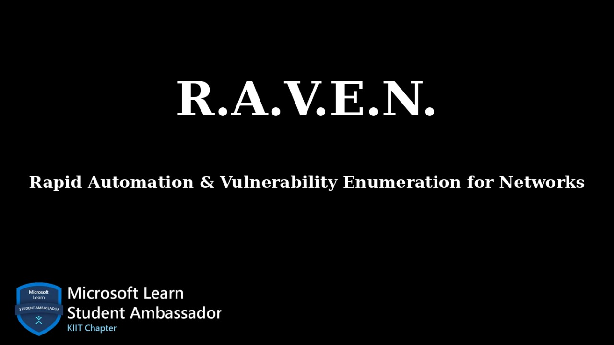

<div align="left">
  
</div>

# R.A.V.E.N : Rapid Automation & Vulnerability Enumeration for Networks

> **An MLSAKIIT Community Project** 🎓  
> *Empowering cybersecurity education through open source collaboration*

[](https://hacktoberfest.com/)
[](LICENSE)
[](https://www.python.org/downloads/)
[](https://www.gnu.org/software/bash/)
[](https://github.com/Ankurdeewan/R.A.V.E.N)
[](https://github.com/Ankurdeewan/R.A.V.E.N)

Open-source cybersecurity toolkit for automated security testing and vulnerability assessment.


## Table of Contents

- [Project Purpose](#project-purpose)
- [Scripts Available](#scripts-available)
- [Quick Start](#quick-start)
- [Contributing](#contributing)
- [Contributors Dashboard](#contributors-dashboard)

## Mission

Provide practical, ready-to-use cybersecurity tools that users can immediately use in their testing workflows.

**What R.A.V.E.N Delivers**:
- **Automation Scripts** - Eliminate repetitive manual tasks in security assessments
- **Production-Ready Tools** - Scripts tested and optimized for real-world environments
- **Time-Saving Solutions** - Reduce hours of manual work to minutes of automated execution
- **Practical Learning** - Hands-on examples that teach security concepts through implementation

## Scripts Available

*This list will be updated after each merge as contributors add new scripts.*

### Scanning
- *No scripts yet - Be the first to contribute!*

### Enumeration  
- *No scripts yet - Be the first to contribute!*

### Exploitation
- *No scripts yet - Be the first to contribute!*

### Crypto
- *No scripts yet - Be the first to contribute!*

### OSINT
- *No scripts yet - Be the first to contribute!*

### Payloads
- *No scripts yet - Be the first to contribute!*

### Utils
- *No scripts yet - Be the first to contribute!*

**📝 Note**: Contributors should update this list when adding new scripts to keep the community informed of available tools.

## Quick Start

```bash
# Clone repository
git clone https://github.com/Ankurdeewan/R.A.V.E.N.git
cd R.A.V.E.N

# Install dependencies
pip install -r requirements.txt

# Run a script (example)
python3 scripts/reconnaissance/subdomain_enum.py -d example.com
```

## Contributing

See [CONTRIBUTING.md](CONTRIBUTING.md) file for details.

## Contributors Dashboard

Thanks to all the amazing contributors who help make R.A.V.E.N better! 


<!-- Add your GitHub username here when you contribute -->
<table>
  <tr>
    <td align="center">
      <a href="https://github.com/MLSAKIIT">
        
        <br />
        <sub><b>@MLSAKIIT</b></sub>
      </a>
      <br />
      <sub>Project Maintainer</sub>
    </td>
    <!-- New contributors will be added here -->
  </tr>
</table>

Want to see your username here? Check out our [Contributing Guidelines](CONTRIBUTING.md) and submit your first script!

## 📄 License

This project is licensed under the MIT License - see the [LICENSE](LICENSE) file for details.

## 🙏 Acknowledgments

- **MLSAKIIT Community** for initiating and maintaining this project
- All contributors who help make R.A.V.E.N better
- Hacktoberfest community for encouraging open source contributions
- Cybersecurity community for sharing knowledge and best practices
- KIIT University for supporting student-led open source initiatives

⭐ **Star this repository**